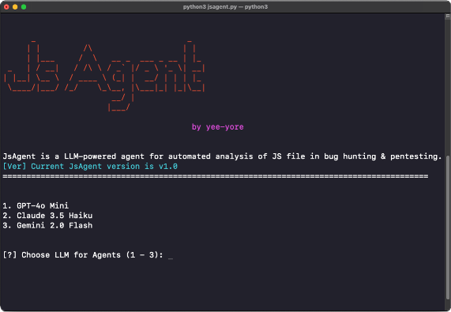

# JsAgent
🤖 LLM-powered agent for automated JS analysis in bug hunting &amp; pentesting.

                   
                                                                                                    
## Usage
1. Git clone
```bash
> git clone https://github.com/yee-yore/JsAgent.git
```

2. Install packages
```bash
# python version = 3.11.9
> pip install -r requirements.txt # for macOS
```

3. Configure API keys in the `.env` file  
- You must set at least **one** LLM API key (e.g., OpenAI, Anthropic, or Gemini) depending on your preference  
- You can also integrate other LLMs: https://docs.crewai.com/concepts/llms
```bash
OPENAI_API_KEY=        # Optional - set if using OpenAI
ANTHROPIC_API_KEY=     # Optional - set if using Anthropic
GEMINI_API_KEY=        # Optional - set if using Gemini (free available)
```

4. Run `jsagent.py`
```bash
> python jsagent.py
```

## Customize
1. Targets (`task()`)
```bash
# You can add things that can be extracted from Javascript (e.g. PII, Credential, Comment, IP address, etc.) to the description.
```
2. Agents (`agents()`)
```bash
# https://docs.crewai.com/concepts/agents
```

## Update Log
- **2025-04-22**: JsAgent ver 1.0